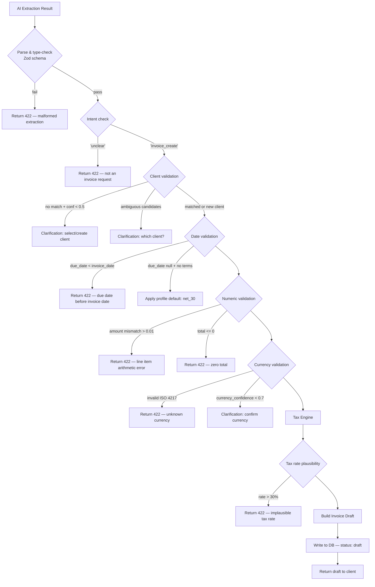
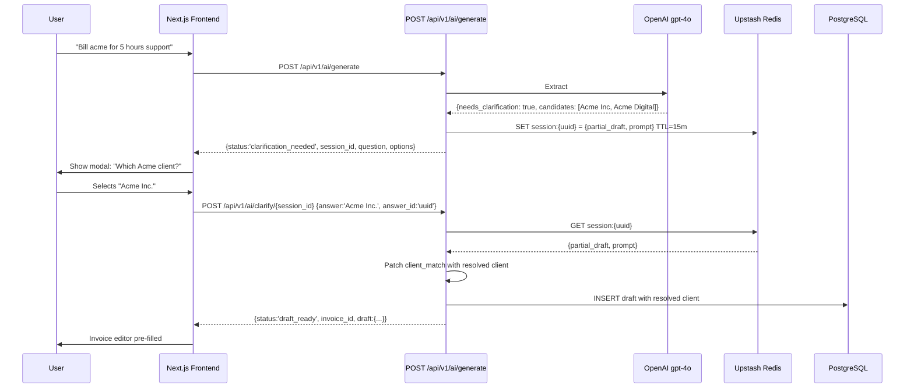

# BillCraft AI — Invoice Generation Workflow

**Version:** 1.0  
**Date:** 2026-06-22  
**Status:** Draft

---

## Table of Contents

1. [Prompt Engineering Strategy](#1-prompt-engineering-strategy)
2. [Validation Workflow](#2-validation-workflow)
3. [Error Handling](#3-error-handling)
4. [Confidence Scoring](#4-confidence-scoring)
5. [Example Prompts](#5-example-prompts)
6. [Edge Cases](#6-edge-cases)
7. [API Design](#7-api-design)

---

## 1. Prompt Engineering Strategy

### 1.1 Overview

The AI layer uses a **single-pass structured extraction** approach via OpenAI `gpt-4o` with JSON Schema enforcement (`response_format: { type: "json_schema" }`). A single call extracts all invoice fields, confidence scores, and clarification questions simultaneously — avoiding multi-pass latency while keeping cost predictable.

```
User Prompt
     │
     ▼
┌──────────────────────────────────────────┐
│  Context Enrichment (server-side)        │
│  • Company profile (country, currency)   │
│  • Client roster (fuzzy match targets)   │
│  • Today's date + user timezone          │
│  • Geo hint from X-User-Region header    │
└──────────────────────────────────────────┘
     │
     ▼
┌──────────────────────────────────────────┐
│  OpenAI gpt-4o                           │
│  system: enriched context + rules        │
│  user:   raw natural language prompt     │
│  format: JSON Schema (strict mode)       │
└──────────────────────────────────────────┘
     │
     ▼
┌──────────────────────────────────────────┐
│  Structured Extraction Result            │
│  • Line items, client match, dates       │
│  • Per-field confidence scores           │
│  • Clarification flags + questions       │
└──────────────────────────────────────────┘
     │
     ▼
┌──────────────────────────────────────────┐
│  Tax Engine (deterministic TypeScript)   │
│  supplier_country × client_country       │
│  × vat_status × supply_type             │
│  → { tax_name, tax_rate, reverse_charge }│
└──────────────────────────────────────────┘
```

### 1.2 System Prompt Template

The system prompt is assembled per-request by the AI service layer. Tokens are managed carefully — the client roster is truncated at 50 clients (most recently invoiced first) to stay within a 4K system-prompt budget.

```
You are an invoice data extraction assistant for BillCraft.

## Context
Today's date: {YYYY-MM-DD}
User timezone: {tz}                    (e.g. "Europe/Berlin")
Company: {company_name}
Company country: {ISO-3166-2}          (e.g. "DE", "US", "AU")
Default currency: {ISO-4217}           (e.g. "EUR", "USD")
Subscription tier: {free|pro|agency}

## Known Clients (up to 50, most recently invoiced first)
{client_list_json}
Each entry: { "id": "uuid", "name": "...", "country": "ISO-3166-2", "is_vat_registered": bool }

## Your Task
1. Extract all invoice fields from the user's input.
2. Match the client to the known clients list. Use fuzzy matching (spelling
   variants, short names, partial matches). If no match, set resolved_id=null.
3. Detect or infer the currency from explicit symbols ($, €, £, ¥), ISO codes
   (USD, EUR), country mentions, or language context.
4. Convert relative dates ("in 14 days", "net 30", "end of month", "next Friday")
   into absolute ISO-8601 dates using today's date.
5. Identify line items. Distinguish hourly billing (e.g. "20 hours at $75/h")
   from fixed-price (e.g. "logo design £2,000") from quantity-based
   (e.g. "50 units at €12 each").
6. Detect mentions of VAT, GST, tax-exempt status, or reverse charge — do NOT
   compute tax yourself; record mentions only.
7. Detect the input language (ISO 639-1 code). Output all JSON keys in English.
   Preserve the original language only in the `notes` field if notes exist.
8. Assign confidence scores (0.0–1.0) per field group.
9. If critical information is missing or ambiguous, set needs_clarification=true
   and provide a single, specific question with up to 4 selectable options.

## Rules
- Return ONLY valid JSON matching the schema. No prose, no markdown fences.
- If the input is not an invoice request (e.g. a question about invoice status),
  set extraction_confidence=0.0 and needs_clarification=true with an explanation.
- Never invent client IDs. Only use UUIDs from the provided client list.
- All monetary values must be positive numbers (no currency symbols in values).
- Dates must be ISO-8601 (YYYY-MM-DD).
```

### 1.3 Client Roster Serialisation

The client list is injected as compact JSON to minimise prompt tokens:

```typescript
const clientRoster = clients.map(c => ({
  id: c.id,
  name: c.display_name,
  aliases: c.aliases ?? [],
  country: c.country_code,
  vat: c.is_vat_registered,
}));
```

This list is cached in Upstash Redis per `company_profile_id` with a 5-minute TTL (see [system_arch.md §9.4](./system_arch.md)).

### 1.4 Structured Output Schema (Zod + JSON Schema)

```typescript
import { z } from 'zod';

const ItemSchema = z.object({
  description:  z.string().min(1),
  billing_type: z.enum(['hourly', 'fixed', 'quantity']),
  quantity:     z.number().positive(),
  unit:         z.string().nullable(),      // "hours", "days", "units", null
  unit_price:   z.number().positive(),
  amount:       z.number().positive(),      // quantity × unit_price
});

const ClientMatchSchema = z.object({
  resolved_id:  z.string().uuid().nullable(),
  display_name: z.string(),
  confidence:   z.number().min(0).max(1),
  candidates:   z.array(z.object({         // populated when ambiguous
    id:   z.string().uuid(),
    name: z.string(),
  })).optional(),
});

export const InvoiceExtractionSchema = z.object({
  // Client
  client_match:           ClientMatchSchema,

  // Dates
  invoice_date:           z.string().regex(/^\d{4}-\d{2}-\d{2}$/),
  due_date:               z.string().regex(/^\d{4}-\d{2}-\d{2}$/).nullable(),
  due_date_offset_days:   z.number().int().min(0).nullable(),
  payment_terms:          z.enum([
                            'net_7','net_14','net_30','net_60',
                            'due_on_receipt','end_of_month'
                          ]).nullable(),

  // Currency
  currency:               z.string().length(3),      // ISO 4217
  currency_confidence:    z.number().min(0).max(1),

  // Line Items
  items:                  z.array(ItemSchema).min(1),

  // Tax Hints (engine computes; AI only flags)
  client_vat_mentioned:   z.boolean(),
  client_vat_number:      z.string().nullable(),
  tax_exempt_mentioned:   z.boolean(),
  reverse_charge_hint:    z.boolean(),

  // Notes & Language
  notes:                  z.string().nullable(),
  detected_language:      z.string().length(2),      // ISO 639-1

  // Clarification
  needs_clarification:    z.boolean(),
  clarification_fields:   z.array(z.string()),       // which fields triggered this
  clarification_question: z.string().nullable(),
  clarification_options:  z.array(z.string()).max(4).nullable(),

  // Overall
  extraction_confidence:  z.number().min(0).max(1),
  intent:                 z.enum(['invoice_create', 'unclear']),
});

export type InvoiceExtraction = z.infer<typeof InvoiceExtractionSchema>;
```

The Zod schema is converted to JSON Schema via `zod-to-json-schema` and passed as `response_format.json_schema.schema` in the OpenAI API call. `strict: true` is set to disable the model generating extra keys.

### 1.5 OpenAI Call Configuration

```typescript
const completion = await openai.chat.completions.create({
  model: 'gpt-4o',
  temperature: 0,                  // deterministic extraction
  max_tokens: 1024,
  response_format: {
    type: 'json_schema',
    json_schema: {
      name: 'invoice_extraction',
      strict: true,
      schema: zodToJsonSchema(InvoiceExtractionSchema),
    },
  },
  messages: [
    { role: 'system', content: buildSystemPrompt(context) },
    { role: 'user',   content: userPrompt },
  ],
});
```

---

## 2. Validation Workflow

Validation runs server-side after the AI extraction, before the draft is written to the database. It is deterministic TypeScript — not another AI call.



### 2.1 Client Validation Rules

| Condition | Action |
|---|---|
| `resolved_id` set, `confidence >= 0.85` | Accept — exact match |
| `resolved_id` set, `confidence 0.60–0.85` | Accept with flag; highlight on UI |
| `resolved_id` null, zero candidates | Clarification: create new client or search |
| Multiple `candidates` with `confidence < 0.60` | Clarification: which client? |
| `resolved_id` set but not in DB (stale cache) | Re-fetch clients, re-run validation |

### 2.2 Date Validation Rules

```typescript
function validateDates(extracted: InvoiceExtraction, today: Date): DateValidationResult {
  const invoiceDate = parseISO(extracted.invoice_date);

  // Reject invoices dated more than 1 year in the past
  if (differenceInDays(today, invoiceDate) > 365) {
    return { valid: false, error: 'invoice_date_too_old' };
  }

  // Resolve due date
  let dueDate: Date;
  if (extracted.due_date) {
    dueDate = parseISO(extracted.due_date);
  } else if (extracted.due_date_offset_days !== null) {
    dueDate = addDays(invoiceDate, extracted.due_date_offset_days);
  } else {
    dueDate = addDays(invoiceDate, 30);      // profile default
  }

  if (!isAfter(dueDate, invoiceDate)) {
    return { valid: false, error: 'due_date_not_after_invoice_date' };
  }

  return { valid: true, invoiceDate, dueDate };
}
```

### 2.3 Numeric Validation Rules

```typescript
function validateItems(items: Item[]): ValidationResult {
  for (const item of items) {
    const computed = round(item.quantity * item.unit_price, 2);
    if (Math.abs(computed - item.amount) > 0.02) {
      return { valid: false, error: `item_amount_mismatch: ${item.description}` };
    }
    if (item.quantity <= 0 || item.unit_price <= 0) {
      return { valid: false, error: 'negative_or_zero_value' };
    }
  }
  const total = items.reduce((s, i) => s + i.amount, 0);
  if (total <= 0) return { valid: false, error: 'zero_total' };
  return { valid: true };
}
```

### 2.4 Currency Validation

Currency codes are validated against a static ISO 4217 allow-list (`src/lib/currencies.ts` — includes all active codes). Exotic codes like `XBT` (Bitcoin) are rejected with a `422`.

### 2.5 Tax Engine Integration

After AI extraction, the tax engine is called synchronously:

```typescript
const taxResult = taxEngine.resolve({
  supplier_country: profile.country_code,
  client_country:   resolvedClient?.country_code ?? null,
  vat_registered:   resolvedClient?.is_vat_registered ?? false,
  supply_type:      'service',
  ai_hints: {
    vat_mentioned:       extraction.client_vat_mentioned,
    tax_exempt_mentioned: extraction.tax_exempt_mentioned,
    reverse_charge_hint:  extraction.reverse_charge_hint,
  },
});
// Returns: { tax_name, tax_rate, is_reverse_charge, display_note }
```

The AI-provided hints override defaults only when explicit (e.g. user typed "tax-exempt").

---

## 3. Error Handling

### 3.1 Error Taxonomy

| Error Code | HTTP | Cause | User-Facing Action |
|---|---|---|---|
| `AI_TIMEOUT` | 503 | OpenAI > 15s | Show manual invoice form; retry button |
| `AI_INVALID_JSON` | 500 | Structured output violated schema | Silent retry (once); then 503 |
| `AI_LOW_CONFIDENCE` | 200 | `extraction_confidence < 0.60` | Clarification flow |
| `AI_WRONG_INTENT` | 422 | Intent = `unclear` | Explain: "This doesn't look like an invoice request" |
| `VALIDATION_DATE` | 422 | Due date before invoice date | Highlight date fields |
| `VALIDATION_NUMERIC` | 422 | Arithmetic mismatch | Highlight item fields |
| `VALIDATION_CURRENCY` | 422 | Invalid ISO 4217 | Ask for currency |
| `RATE_LIMIT` | 429 | > 20 AI calls/hour | Show retry-after countdown |
| `QUOTA_EXCEEDED` | 402 | Free tier invoice limit | Upgrade prompt |

### 3.2 Retry Logic

```typescript
async function extractWithRetry(
  prompt: string,
  context: ExtractionContext,
): Promise<InvoiceExtraction> {
  for (let attempt = 0; attempt < 2; attempt++) {
    try {
      const raw = await callOpenAI(prompt, context, attempt);
      const parsed = InvoiceExtractionSchema.safeParse(JSON.parse(raw));
      if (parsed.success) return parsed.data;

      // On parse failure inject a schema reminder into user message
      prompt = `${prompt}\n\n[System: previous response had invalid JSON. Return only valid JSON.]`;
    } catch (err) {
      if (isOpenAITimeout(err) || attempt === 1) throw err;
    }
  }
  throw new Error('AI_INVALID_JSON');
}
```

Retry adds ≤ 15s to P99 latency. Retry attempts are logged with `attempt` tag for monitoring.

### 3.3 OpenAI Outage Degradation

Per [system_arch.md §10.6](./system_arch.md), on OpenAI outage:
- The AI prompt UI (`/invoices/new?mode=ai`) is hidden.
- The manual invoice form (`/invoices/new?mode=manual`) is always available.
- The `GET /api/v1/ai/health` endpoint checks OpenAI reachability (cached in Redis, 60s TTL).
- The frontend polls `/api/v1/ai/health` every 60s and shows a banner if AI is unavailable.

### 3.4 Error Response Schema

```typescript
interface AIErrorResponse {
  status: 'error';
  code: string;                    // e.g. 'AI_TIMEOUT'
  message: string;                 // human-readable, localised
  retry_after?: number;            // seconds (RATE_LIMIT only)
  session_id?: string;             // present if clarification_needed
}
```

---

## 4. Confidence Scoring

### 4.1 Field-Level Confidence

The model assigns confidence per group. The table shows what drives each score:

| Field Group | High ≥ 0.85 | Medium 0.60–0.85 | Low < 0.60 |
|---|---|---|---|
| **client_match** | Exact name in client list | Fuzzy single candidate | Multiple candidates or no match |
| **currency** | Explicit symbol (`$`, `€`) or ISO code (`USD`) | Country-inferred (`invoice in German → EUR`) | Not mentioned; using company default |
| **due_date** | Explicit date or `"net N"` | `"end of month"`, `"soon"` | Not mentioned |
| **items** | All fields stated (qty, price, desc) | Quantity inferred from context | Price or quantity absent |

### 4.2 Overall Confidence Formula

```typescript
function computeOverallConfidence(e: InvoiceExtraction): number {
  return (
    e.client_match.confidence          * 0.35 +
    e.currency_confidence              * 0.15 +
    computeItemsConfidence(e.items)    * 0.35 +
    computeDateConfidence(e)           * 0.15
  );
}

function computeItemsConfidence(items: Item[]): number {
  // Average confidence across items; penalise missing units on hourly billing
  return items.reduce((sum, item) => {
    let score = 1.0;
    if (item.billing_type === 'hourly' && item.unit === null) score -= 0.2;
    if (item.amount !== round(item.quantity * item.unit_price, 2)) score -= 0.3;
    return sum + Math.max(0, score);
  }, 0) / items.length;
}
```

### 4.3 Confidence Thresholds and Actions

| Range | Status | Action |
|---|---|---|
| `>= 0.85` | `draft_ready` | Auto-create draft; show for review |
| `0.60 – 0.85` | `draft_ready_with_warnings` | Create draft; highlight low-confidence fields in amber |
| `< 0.60` | `clarification_needed` | Hold; ask single clarification question |

Low-confidence fields are surfaced to the frontend as `warnings: string[]`, allowing the invoice editor to visually flag them without blocking submission.

### 4.4 Confidence Stored for Analytics

`extraction_confidence` and per-field scores are stored in `invoices.ai_metadata JSONB` for product analytics. This data informs prompt tuning — invoices later edited by users after AI generation identify model blind spots.

---

## 5. Example Prompts

### 5.1 Basic Hourly Billing

**Input:**
```
Create an invoice for Acme Inc. for website redesign services, 20 hours at $75 per hour, due in 14 days.
```

**Extraction:**
```json
{
  "client_match": { "resolved_id": "uuid-acme", "display_name": "Acme Inc.", "confidence": 0.97 },
  "invoice_date": "2026-06-22",
  "due_date": "2026-07-06",
  "due_date_offset_days": 14,
  "payment_terms": "net_14",
  "currency": "USD",
  "currency_confidence": 0.99,
  "items": [{
    "description": "Website redesign services",
    "billing_type": "hourly",
    "quantity": 20,
    "unit": "hours",
    "unit_price": 75.00,
    "amount": 1500.00
  }],
  "client_vat_mentioned": false,
  "client_vat_number": null,
  "tax_exempt_mentioned": false,
  "reverse_charge_hint": false,
  "notes": null,
  "detected_language": "en",
  "needs_clarification": false,
  "clarification_fields": [],
  "clarification_question": null,
  "clarification_options": null,
  "extraction_confidence": 0.96,
  "intent": "invoice_create"
}
```

---

### 5.2 Fixed-Price with GBP

**Input:**
```
Invoice TechCorp for the brand identity project — flat fee £4,500, payment due end of month.
```

**Extraction (key fields):**
```json
{
  "client_match": { "resolved_id": "uuid-techcorp", "display_name": "TechCorp", "confidence": 0.91 },
  "due_date": "2026-06-30",
  "payment_terms": "end_of_month",
  "currency": "GBP",
  "currency_confidence": 0.99,
  "items": [{
    "description": "Brand identity project",
    "billing_type": "fixed",
    "quantity": 1,
    "unit": null,
    "unit_price": 4500.00,
    "amount": 4500.00
  }],
  "extraction_confidence": 0.93
}
```

---

### 5.3 Multi-Item with EUR and VAT Mention

**Input:**
```
Rechnung für Müller GmbH: 8 Stunden Webentwicklung à 120€ und Reisekosten 280€, zzgl. MwSt., Zahlungsziel 30 Tage.
```
*(German: Invoice for Müller GmbH: 8 hours web development at €120 and travel expenses €280, plus VAT, payment term 30 days.)*

**Extraction (key fields):**
```json
{
  "client_match": { "resolved_id": "uuid-muller", "display_name": "Müller GmbH", "confidence": 0.95 },
  "payment_terms": "net_30",
  "currency": "EUR",
  "currency_confidence": 0.99,
  "items": [
    {
      "description": "Webentwicklung",
      "billing_type": "hourly",
      "quantity": 8,
      "unit": "Stunden",
      "unit_price": 120.00,
      "amount": 960.00
    },
    {
      "description": "Reisekosten",
      "billing_type": "fixed",
      "quantity": 1,
      "unit": null,
      "unit_price": 280.00,
      "amount": 280.00
    }
  ],
  "client_vat_mentioned": true,
  "detected_language": "de",
  "notes": "zzgl. MwSt.",
  "extraction_confidence": 0.94
}
```

Tax engine then applies DE→DE 19% VAT based on both parties being German.

---

### 5.4 Ambiguous Client → Clarification

**Input:**
```
Bill Acme for 5 hours support at $100/hour.
```

Two clients in DB: `Acme Inc.` and `Acme Digital Ltd`.

**Extraction:**
```json
{
  "client_match": {
    "resolved_id": null,
    "display_name": "Acme",
    "confidence": 0.48,
    "candidates": [
      { "id": "uuid-acme-inc",     "name": "Acme Inc." },
      { "id": "uuid-acme-digital", "name": "Acme Digital Ltd" }
    ]
  },
  "needs_clarification": true,
  "clarification_fields": ["client_match"],
  "clarification_question": "Which Acme client should this invoice go to?",
  "clarification_options": ["Acme Inc.", "Acme Digital Ltd", "Create a new client called 'Acme'"],
  "extraction_confidence": 0.52
}
```

Session is stored in Redis (`session:{id}`, TTL 15 min). After user selects, `POST /api/v1/ai/clarify/{session_id}` resolves and completes the draft.

---

### 5.5 New Client (Not in DB)

**Input:**
```
Create invoice for Johnson & Smith LLC, consulting services, $8,000 fixed, net 30.
```

**Extraction:**
```json
{
  "client_match": {
    "resolved_id": null,
    "display_name": "Johnson & Smith LLC",
    "confidence": 0.0,
    "candidates": []
  },
  "needs_clarification": true,
  "clarification_fields": ["client_match"],
  "clarification_question": "Johnson & Smith LLC isn't in your client list. What would you like to do?",
  "clarification_options": [
    "Create Johnson & Smith LLC as a new client",
    "Choose an existing client instead"
  ],
  "extraction_confidence": 0.71
}
```

---

### 5.6 Missing Price → Clarification

**Input:**
```
Invoice Globex Corp for 10 hours of data analysis work, due next Friday.
```

No price given.

**Extraction:**
```json
{
  "items": [{
    "description": "Data analysis work",
    "billing_type": "hourly",
    "quantity": 10,
    "unit": "hours",
    "unit_price": 0,
    "amount": 0
  }],
  "needs_clarification": true,
  "clarification_fields": ["items[0].unit_price"],
  "clarification_question": "What's your hourly rate for this work?",
  "clarification_options": null,
  "extraction_confidence": 0.55
}
```

---

## 6. Edge Cases

### 6.1 Multiple Currencies in One Prompt

**Input:** `"Bill for 10h at $100 and €500 travel expenses."`

**Behaviour:** AI sets `needs_clarification=true`, flags `currency` field.  
**Question:** "Your invoice has amounts in both USD and EUR. Which currency should I use for the whole invoice?"  
**Options:** `["USD (convert travel to USD)", "EUR (convert hours to EUR)", "Keep USD only", "Keep EUR only"]`

---

### 6.2 Conflicting or Invalid Dates

**Input:** `"Invoice Acme, due yesterday."`

**Behaviour:** AI computes `due_date = today - 1 day`. Validation layer catches `due_date < invoice_date`, returns `422 VALIDATION_DATE`.  
**User message:** "Due date must be after the invoice date. The invoice date is today (2026-06-22) — please choose a future date."

---

### 6.3 Non-Invoice Request

**Input:** `"What's the status of the Acme invoice from last week?"`

**Behaviour:** AI sets `intent = 'unclear'`, `extraction_confidence = 0.0`.  
**API Response:** `422` with message: "This looks like an invoice status question. Use the invoice list to search for it."

---

### 6.4 Recurring Invoice Request

**Input:** `"Set up a monthly retainer for StartupX, $3,000/month."`

**Behaviour:** AI extracts one-time invoice for $3,000. Notes field receives: "Monthly retainer — recurring billing not yet supported."  
**UI Banner:** "Recurring invoices are on the roadmap. This draft was created as a one-time invoice."

---

### 6.5 Zero-Amount or Complimentary Line Item

**Input:** `"Invoice Globex: 5h dev at $120/h, and include a complimentary SEO audit."`

**Behaviour:** AI creates two items. The SEO audit item has `quantity=1, unit_price=0, amount=0`.  
**Validation:** Zero-price items are allowed (validation only rejects zero *total*). Item is flagged in UI as "£0.00 — complimentary."

---

### 6.6 Extremely Large Invoice Amount

**Input:** `"Invoice BigCorp $2,500,000 for platform migration project."`

**Behaviour:** Extraction succeeds normally. A soft warning is added to `ai_metadata.warnings`: `["high_value_invoice"]`.  
**UI:** Amber banner — "This invoice is over $1,000,000 — please review carefully before sending."

---

### 6.7 VAT Number Provided in Prompt

**Input:** `"Invoice EU Dynamics GmbH (VAT: DE123456789) for consulting, €5,000, net 30."`

**Behaviour:** AI sets `client_vat_number = "DE123456789"`, `client_vat_mentioned = true`.  
**Tax engine:** Detects EU B2B supply → applies reverse charge (0% on invoice, note on invoice).  
**DB:** `client_vat_number` stored in `invoices.metadata` and propagated to the PDF template.

---

### 6.8 Discount Mention

**Input:** `"Invoice Acme $5,000 for consulting with a 10% early payment discount if paid within 7 days."`

**Behaviour:** Discount line items are not in the MVP schema. AI captures the discount in `notes`.  
**UI:** Note displayed on draft: "10% early payment discount if paid within 7 days."  
The user can manually add a discount line item in the editor.

---

### 6.9 Time Zone Ambiguity for "End of Month"

**Input:** `"Invoice due end of month"` (user in UTC+9, server in UTC).

**Behaviour:** System prompt includes user's IANA timezone. `"end of month"` resolves to the last calendar day of the current month **in the user's timezone** — then stored as UTC midnight.

---

### 6.10 Stale Client Cache

**Scenario:** A new client was added 3 minutes ago; the cache TTL is 5 minutes; the AI returns `resolved_id=null`.

**Behaviour:** After extraction, if `resolved_id=null` and `display_name` closely matches a recent DB query, the service layer does a direct DB lookup (bypassing cache) before triggering clarification. If a match is found, extraction confidence is patched and clarification is skipped.

---

## 7. API Design

### 7.1 Endpoint: Generate Invoice Draft

```
POST /api/v1/ai/generate
Authorization: Bearer <access_token>
Content-Type: application/json
```

**Request:**
```typescript
interface GenerateRequest {
  profile_id: string;      // UUID — which company profile
  prompt:     string;      // 1–2000 chars, user's natural language
  locale?:    string;      // BCP-47 (e.g. "de-DE") for response language hints
}
```

**Response — Draft Ready (200):**
```typescript
interface DraftReadyResponse {
  status:      'draft_ready' | 'draft_ready_with_warnings';
  invoice_id:  string;                // UUID of created draft
  draft: {
    client_name:    string;
    client_id:      string | null;
    invoice_date:   string;           // YYYY-MM-DD
    due_date:       string;           // YYYY-MM-DD
    currency:       string;           // ISO 4217
    items:          DraftItem[];
    subtotal:       number;
    tax_amount:     number;
    tax_name:       string | null;    // "VAT", "GST", etc.
    tax_rate:       number;           // e.g. 0.19
    is_reverse_charge: boolean;
    total:          number;
    payment_terms:  string | null;
    notes:          string | null;
  };
  warnings?:          string[];       // field keys with low confidence
  extraction_confidence: number;
}
```

**Response — Clarification Needed (200):**
```typescript
interface ClarificationResponse {
  status:               'clarification_needed';
  session_id:           string;          // Redis key, TTL 15 min
  clarification_fields: string[];
  question:             string;
  options:              string[] | null; // null = free-text answer
  partial_draft?:       Partial<DraftReadyResponse['draft']>;
}
```

**Error Responses:**

| Status | Body `code` | Meaning |
|---|---|---|
| 422 | `WRONG_INTENT` | Input is not an invoice request |
| 422 | `VALIDATION_DATE` | Date logic violation |
| 422 | `VALIDATION_NUMERIC` | Arithmetic mismatch in line items |
| 422 | `VALIDATION_CURRENCY` | Unknown ISO 4217 code |
| 429 | `RATE_LIMIT` | > 20 AI calls/hour; includes `retry_after` seconds |
| 402 | `QUOTA_EXCEEDED` | Free tier monthly invoice limit reached |
| 503 | `AI_UNAVAILABLE` | OpenAI unreachable after retry |

---

### 7.2 Endpoint: Submit Clarification Answer

```
POST /api/v1/ai/clarify/{session_id}
Authorization: Bearer <access_token>
Content-Type: application/json
```

**Request:**
```typescript
interface ClarifyRequest {
  answer:     string;           // selected option text or free-text input
  answer_id?: string;           // UUID when answer is a client selection
}
```

**Response:** Same schema as `POST /api/v1/ai/generate` — either `draft_ready` or another `clarification_needed` (max 2 clarification rounds before falling back to manual form).

**Session expiry:** If the Redis session has expired (> 15 min), returns `410 Gone` with `code: SESSION_EXPIRED`. The frontend prompts the user to re-submit their original prompt.

---

### 7.3 Endpoint: AI Health Check

```
GET /api/v1/ai/health
Authorization: Bearer <access_token>
```

**Response:**
```typescript
interface AIHealthResponse {
  available:    boolean;
  latency_ms?:  number;     // last successful OpenAI call latency
  checked_at:   string;     // ISO-8601
}
```

Cached in Redis for 60 seconds. Used by the frontend to conditionally show/hide the AI prompt UI.

---

### 7.4 Rate Limiting Headers

All `POST /api/v1/ai/*` responses include:

```
X-RateLimit-Limit: 20
X-RateLimit-Remaining: 17
X-RateLimit-Reset: 1719000000      (Unix epoch when window resets)
Retry-After: 120                   (only on 429)
```

---

### 7.5 Sequence Diagram — Full Happy Path

```mermaid
sequenceDiagram
    participant U as User
    participant FE as Next.js Frontend
    participant MW as Edge Middleware
    participant API as POST /api/v1/ai/generate
    participant Cache as Upstash Redis
    participant OAI as OpenAI gpt-4o
    participant TAX as Tax Engine
    participant VAL as Validation Layer
    participant DB as PostgreSQL

    U->>FE: Types prompt, submits form
    FE->>MW: POST /api/v1/ai/generate
    MW->>MW: JWT validation + rate-limit check (Redis)
    MW->>API: Forward request
    API->>Cache: GET client_roster:{profile_id}
    Cache-->>API: Client list (or DB fallback)
    API->>API: Build system prompt with context
    API->>OAI: chat.completions (gpt-4o, json_schema)
    OAI-->>API: Structured JSON
    API->>API: Zod parse + intent check
    API->>VAL: Client / date / numeric / currency validation
    VAL-->>API: Validation result
    API->>TAX: resolve(supplier, client, vat_flags)
    TAX-->>API: {tax_name, tax_rate, is_reverse_charge}
    API->>DB: INSERT invoices + line_items + tax_lines (status='draft')
    API-->>FE: {status:'draft_ready', invoice_id, draft:{...}}
    FE->>U: Invoice editor pre-filled, ready for review
```



---

### 7.6 Sequence Diagram — Clarification Path



---

*End of Document*

---

**Document Control**

| Version | Date | Author | Notes |
|---|---|---|---|
| 1.0 | 2026-06-22 | Architecture Team | Initial draft |
