# BillCraft AI — System Architecture

**Version:** 1.0  
**Date:** 2026-06-22  
**Status:** Draft

---

## Table of Contents

1. [High-Level Architecture Diagram](#1-high-level-architecture-diagram)
2. [Component Descriptions](#2-component-descriptions)
3. [Database Design Approach](#3-database-design-approach)
4. [Authentication Flow](#4-authentication-flow)
5. [AI Processing Workflow](#5-ai-processing-workflow)
6. [Stripe Workflow](#6-stripe-workflow)
7. [Email Workflow](#7-email-workflow)
8. [Security Considerations](#8-security-considerations)
9. [Scalability Considerations](#9-scalability-considerations)
10. [Deployment Architecture](#10-deployment-architecture)

---

## 1. High-Level Architecture Diagram

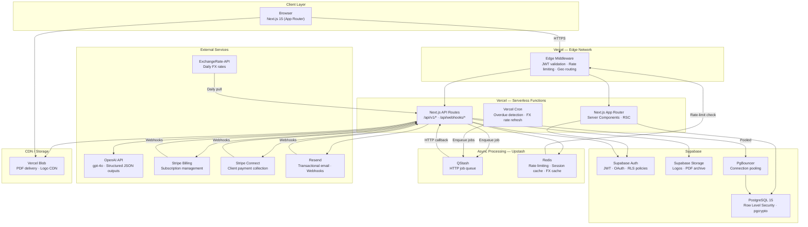

---

## 2. Component Descriptions

### 2.1 Frontend — Next.js 15 App Router

| Concern | Approach |
|---|---|
| Rendering | Server Components for data-heavy pages (dashboard, invoice list); Client Components for interactive editors and AI prompt form |
| Styling | Tailwind CSS utility classes; shadcn/ui component library |
| i18n | `next-intl` with locale routing (`/en`, `/de`, `/fr`); message catalogs in `/messages` |
| Timezone | All timestamps stored as UTC; displayed via `Intl.DateTimeFormat` using the user's browser/profile locale |
| Currency formatting | `Intl.NumberFormat` with the invoice's ISO 4217 currency code |
| PDF preview | iFrame or `react-pdf` rendered from a server-signed CDN URL |
| State management | React Server Components + Next.js Server Actions for mutations; `zustand` for ephemeral UI state (invoice editor) |

### 2.2 API Layer — Next.js API Routes

All business logic lives in `/app/api/` route handlers (Next.js App Router conventions).

| Layer | Responsibility |
|---|---|
| Route handlers | HTTP contract: parse input, validate with `zod`, call service layer, return JSON |
| Service layer | Domain logic: invoice creation, tax computation, AI orchestration |
| Repository layer | Supabase client queries; all queries pass the authenticated JWT so RLS fires |
| Webhook handlers | `/api/webhooks/stripe` and `/api/webhooks/email`; validate signatures before touching the DB |

### 2.3 Edge Middleware

Runs at Vercel's edge (globally distributed, before serverless functions):

- **JWT validation**: Verifies Supabase JWT on every non-public route; rejects expired tokens with `401`.
- **Rate limiting**: Checks Upstash Redis sliding-window counter per user ID and IP.
- **Geo routing**: Reads `x-vercel-ip-country` to attach `X-User-Region` header (used downstream for GDPR data-residency decisions and tax-rule hints).
- **Security headers**: Injects `Content-Security-Policy`, `Strict-Transport-Security`, `X-Frame-Options`, `Referrer-Policy`.

### 2.4 Supabase Auth

Manages identity without custom auth servers:

- Email/password registration with verification link.
- Google OAuth 2.0 (server-side PKCE flow via Next.js callback route).
- Short-lived access tokens (1 hour JWT) + rotating refresh tokens.
- Custom claims in JWT: `subscription_tier`, `active_profile_id`.
- Row Level Security policies in PostgreSQL enforce data isolation for every query that passes the user JWT.

### 2.5 PostgreSQL (Supabase-managed)

- All tables in a single `billcraft` schema with Row Level Security enabled on every table.
- Connection pooling via PgBouncer (transaction mode) for serverless connection bursts.
- Read replica (Supabase "Read replicas" feature) for analytics/dashboard queries.
- Point-in-time recovery with 30-day backup retention.

### 2.6 Async Job Queue — Upstash QStash

Heavy operations run outside the HTTP request lifecycle:

| Job Type | Trigger | Worker |
|---|---|---|
| PDF generation | Invoice send action | `/api/jobs/generate-pdf` |
| Email delivery | Invoice send action | `/api/jobs/send-invoice-email` |
| Overdue reminder | Daily cron | `/api/jobs/send-reminder-email` |
| Stripe payment link creation | Invoice send action | `/api/jobs/create-payment-link` |
| GDPR deletion | Account deletion request | `/api/jobs/gdpr-purge` |
| FX rate refresh | Daily cron | `/api/jobs/refresh-fx-rates` |

QStash provides HTTP-based queuing with retries and dead-letter queue, requiring no persistent worker process — compatible with Vercel's serverless model.

### 2.7 Storage — Vercel Blob + Supabase Storage

| Asset | Storage | Access Pattern |
|---|---|---|
| Company logos | Supabase Storage | Public CDN URL; uploaded at profile creation |
| Generated PDFs | Vercel Blob | Private; served via time-limited signed URL |
| Invoice email attachments | Generated inline | Streamed to Resend; not stored twice |

PDFs are retained for 5 years per compliance requirements, with signed URLs expiring after 1 hour for download endpoints.

### 2.8 Tax Rule Engine

A deterministic TypeScript module (no external service):

```
Input:  supplier_country × client_country × client_vat_registered × supply_type
Output: { tax_name, tax_rate, is_reverse_charge, display_note }
```

Rules maintained as a structured lookup table supporting: standard VAT, zero-rated VAT, EU B2B reverse-charge, AU/CA/IN/SG GST, US sales tax advisory, and no-tax. The engine runs synchronously inside the AI service layer, applied after entity extraction.

---

## 3. Database Design Approach

### 3.1 Multi-Tenancy Model

BillCraft uses **shared database, shared schema** multi-tenancy. Tenant isolation is enforced at the database level via PostgreSQL Row Level Security, not in application code.

```sql
-- Example RLS policy on invoices
CREATE POLICY "users can access own invoices"
ON invoices
FOR ALL
USING (
  company_profile_id IN (
    SELECT id FROM company_profiles WHERE user_id = auth.uid()
  )
);
```

Every table that holds user data has an active RLS policy. The Supabase client on API routes always passes the authenticated JWT, so every query is automatically scoped.

### 3.2 Schema Design Principles

| Principle | Implementation |
|---|---|
| Tenant scoping | All business tables reference `company_profile_id` (not raw `user_id`) to support Agency multi-profile |
| Soft deletes | `is_archived` boolean; hard deletes only for GDPR purge jobs |
| Immutable audit trail | `invoice_events` is append-only; status changes never overwrite the row |
| Computed amounts stored | `amount`, `subtotal`, `total_tax`, `total` are stored (not computed on read) for audit accuracy |
| JSON for flexibility | `metadata JSONB` on `invoice_events` for extensible event payloads |
| Timestamps always UTC | All `TIMESTAMPTZ` columns; application layer handles locale display |

### 3.3 Entity Relationship

```
users
  └──< company_profiles (user_id)
         ├──< clients (company_profile_id)
         └──< invoices (company_profile_id)
                ├──< line_items (invoice_id)
                ├──< tax_lines (invoice_id)
                ├──< payments (invoice_id)
                ├──< invoice_events (invoice_id)  ← audit log
                └──< reminder_logs (invoice_id)
```

### 3.4 Key Indexes

```sql
-- Tenant-scoped lookups (most frequent query pattern)
CREATE INDEX idx_invoices_company_status ON invoices(company_profile_id, status);
CREATE INDEX idx_invoices_due_date ON invoices(due_date) WHERE status NOT IN ('paid', 'void');
CREATE INDEX idx_clients_company ON clients(company_profile_id) WHERE is_archived = false;

-- Webhook reconciliation
CREATE UNIQUE INDEX idx_invoices_stripe_link ON invoices(stripe_payment_link_id) WHERE stripe_payment_link_id IS NOT NULL;
CREATE UNIQUE INDEX idx_payments_charge ON payments(stripe_charge_id) WHERE stripe_charge_id IS NOT NULL;

-- Shareable token lookup (public invoice view)
CREATE UNIQUE INDEX idx_invoices_token ON invoices(shareable_token);

-- Overdue cron scan
CREATE INDEX idx_invoices_overdue_candidates ON invoices(due_date, status) WHERE status = 'sent';
```

### 3.5 GDPR Data Lifecycle

1. User requests deletion → `users.gdpr_deletion_requested_at` set, GDPR purge job enqueued.
2. Job anonymises PII within 30 days: nullifies emails, names, addresses in `clients`, `company_profiles`, `invoices`. Replaces with `[deleted]` sentinel.
3. Aggregate financial records (amounts, dates, tax) retained for legal/tax audit purposes.
4. Supabase Auth user record deleted immediately via `supabase.auth.admin.deleteUser()`.
5. PDF files in Vercel Blob deleted by blob URL reference list stored at deletion-request time.

### 3.6 Regional Data Residency

Supabase projects are provisioned in separate regions:

| Users | Supabase Region | Vercel Region |
|---|---|---|
| US, Canada, APAC | `us-east-1` | `iad1` |
| EU, UK | `eu-central-1` | `fra1` |

Region assignment is determined at signup using the `X-User-Region` header injected by edge middleware. The user's region is stored in `users.data_region` and subsequent API requests are routed to the matching database endpoint.

---

## 4. Authentication Flow

### 4.1 Email/Password Registration

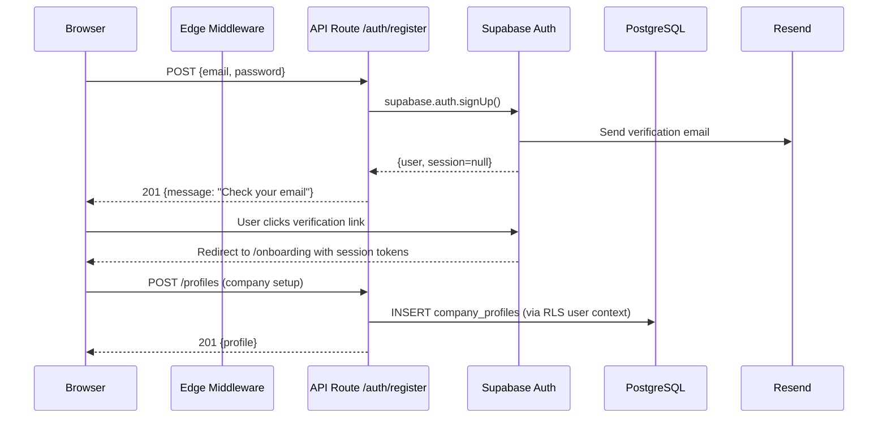

### 4.2 Google OAuth

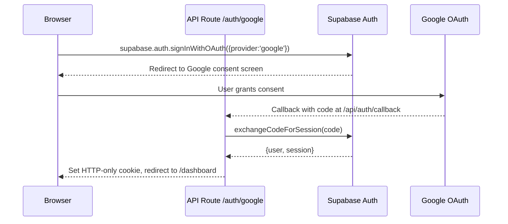

### 4.3 Session Management

- **Access token**: JWT, 1-hour TTL, stored in memory (not localStorage to prevent XSS).
- **Refresh token**: Stored in an HTTP-only, Secure, SameSite=Strict cookie.
- **Middleware**: Every request to `/app/*` and `/api/v1/*` validates the JWT via Supabase's `getUser()`. On expiry, the middleware silently refreshes using the cookie.
- **Token rotation**: Each refresh issues a new refresh token (old one immediately invalidated).
- **Force logout**: Supabase `auth.signOut(scope='global')` invalidates all sessions across devices.

### 4.4 Role-Based Access Control

| Role | Scope | Capabilities |
|---|---|---|
| `owner` | Per company profile | Full CRUD; billing management; Stripe Connect; team seat management |
| `member` | Per company profile | Create/edit invoices; view dashboard; cannot delete profiles or manage billing |

Roles stored in `team_members` table (Agency tier). JWT custom claims carry the user's role for the active profile, evaluated in middleware for route-level gating.

---

## 5. AI Processing Workflow

### 5.1 Happy Path

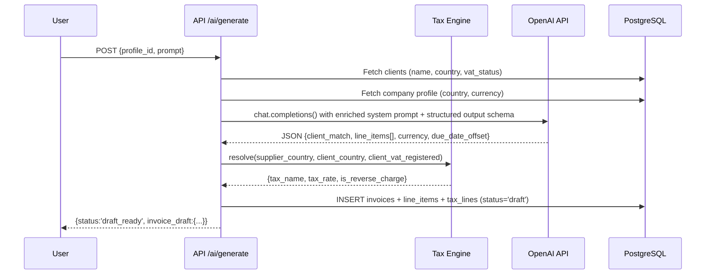

### 5.2 Clarification Path

When entity extraction confidence is below threshold (e.g., multiple client matches):

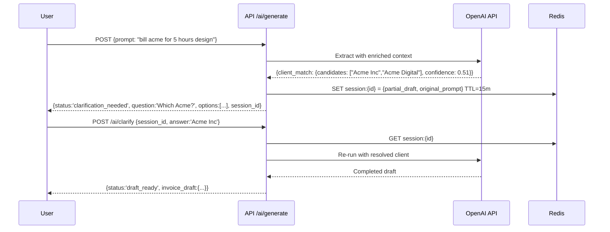

### 5.3 OpenAI Structured Output Schema

```typescript
const invoiceDraftSchema = z.object({
  client_match: z.object({
    resolved_id: z.string().uuid().nullable(),
    display_name: z.string(),
    confidence: z.number().min(0).max(1),
  }),
  line_items: z.array(z.object({
    description: z.string(),
    quantity: z.number().positive(),
    unit: z.string().nullable(),
    unit_price: z.number().positive(),
  })),
  currency: z.string().length(3),
  due_date_offset_days: z.number().int().min(0),
  notes: z.string().nullable(),
  clarification_needed: z.boolean(),
  clarification_question: z.string().nullable(),
});
```

The system prompt includes: the user's client list (id, display_name, country, is_vat_registered), company country, default currency, today's date, and explicit instructions to return structured JSON only.

### 5.4 GDPR Compliance for AI Calls

- Client PII in the system prompt is sent under OpenAI's Data Processing Agreement (zero data retention enabled via API header `OpenAI-Data-Retention: false` where supported).
- Raw prompts are stored in `invoices.ai_prompt` for audit purposes but flagged for GDPR purge.
- No PII is sent in the user-facing message — system prompt handles enrichment.

---

## 6. Stripe Workflow

BillCraft operates two distinct Stripe integrations simultaneously.

### 6.1 BillCraft Subscription Billing (Stripe Billing)

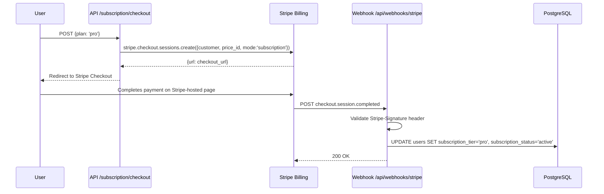

Subscription lifecycle events handled: `customer.subscription.updated`, `customer.subscription.deleted`, `invoice.payment_failed` (→ `past_due`).

### 6.2 Client Payment Collection (Stripe Connect)

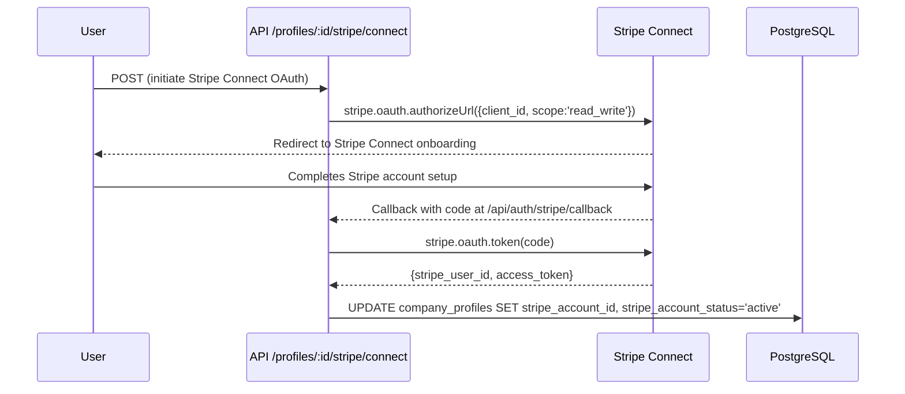

### 6.3 Invoice Payment Link Creation

When an invoice is sent:

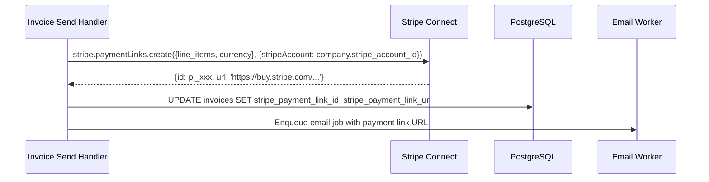

### 6.4 Payment Received Webhook

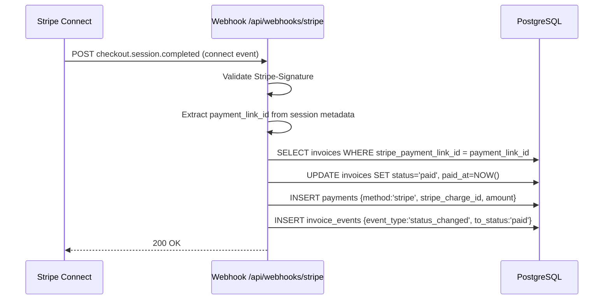

Idempotency: webhook handler checks for existing payment record by `stripe_charge_id` before inserting.

---

## 7. Email Workflow

### 7.1 Invoice Send Flow

```mermaid
sequenceDiagram
    participant U as User
    participant API as POST /invoices/:id/send
    participant QS as QStash
    participant PDF as PDF Worker
    participant Blob as Vercel Blob
    participant Link as Payment Link Worker
    participant Email as Email Worker
    participant Resend as Resend API

    U->>API: POST /invoices/:id/send {message}
    API->>QS: Enqueue generate-pdf job
    API->>QS: Enqueue create-payment-link job
    API->>DB: UPDATE invoices SET status='sent', email_sent_at=NOW()
    API-->>U: 202 Accepted

    QS->>PDF: Invoke /api/jobs/generate-pdf
    PDF->>PDF: Render invoice HTML template (React → static HTML)
    PDF->>PDF: puppeteer/playwright → PDF bytes
    PDF->>Blob: Upload PDF, get CDN URL
    PDF->>DB: UPDATE invoices SET pdf_url

    QS->>Link: Invoke /api/jobs/create-payment-link
    Link->>SC: Create Stripe Payment Link
    Link->>DB: UPDATE invoices SET stripe_payment_link_url

    QS->>Email: Invoke /api/jobs/send-invoice-email (after pdf + link ready)
    Email->>DB: Fetch invoice with pdf_url, stripe_payment_link_url
    Email->>Resend: emails.send({to, subject, html, attachments:[pdf]})
    Resend-->>Email: {id: email_id}
    Email->>DB: UPDATE invoices SET email_sent_at
```

### 7.2 Email Tracking

The HTML email body includes a 1×1 pixel `` served from `/api/track/view?token={invoice.shareable_token}`. When the client opens the email:

```
GET /api/track/view?token=abc123
  → UPDATE invoices SET email_viewed_at=NOW(), status='viewed' WHERE shareable_token='abc123' AND email_viewed_at IS NULL
  → INSERT invoice_events {event_type: 'viewed'}
  → Return 1×1 transparent GIF
```

### 7.3 Overdue Reminder Flow

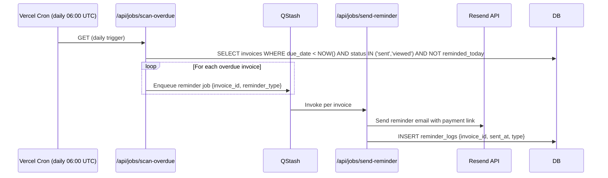

Reminder schedule (MVP): single reminder 7 days after due date. Phase 2 adds configurable schedules stored in `reminder_schedules` table.

### 7.4 Resend Delivery Webhooks

Resend posts delivery events to `/api/webhooks/email`:

| Event | Action |
|---|---|
| `email.delivered` | `UPDATE reminder_logs SET delivery_status='delivered'` |
| `email.bounced` | `UPDATE reminder_logs SET delivery_status='bounced'`; flag client email as invalid |
| `email.complained` | Log event; optionally suppress future emails to that address |

---

## 8. Security Considerations

### 8.1 Authentication & Session Security

| Control | Implementation |
|---|---|
| Token storage | Access token in memory; refresh token in HTTP-only + Secure + SameSite=Strict cookie |
| CSRF protection | SameSite=Strict cookie + Next.js CSRF headers for mutations |
| Brute force | 10 attempts/minute per IP on auth endpoints via Upstash Redis rate limiter |
| Session fixation | Supabase issues new session on login; old tokens invalidated |
| MFA (Phase 2) | Supabase Auth supports TOTP via `supabase.auth.mfa.*` APIs |

### 8.2 Data Isolation

- PostgreSQL RLS enforced at the DB engine level — even a compromised API route cannot read cross-tenant data when using the authenticated Supabase client.
- Service-role Supabase key (bypasses RLS) used only in webhook handlers and admin jobs, never exposed to client-side code.
- Shareable invoice tokens are 64-character cryptographically random strings (not sequential IDs) — prevents enumeration.

### 8.3 Input Validation & Injection Prevention

- All API inputs validated with `zod` schemas before reaching service layer.
- Supabase client uses parameterised queries; no raw SQL string interpolation.
- AI prompts are user-generated strings — never interpolated into SQL. They are passed only to OpenAI.
- `Content-Security-Policy` header blocks inline scripts and restricts resource origins.
- PDF generation runs in a sandboxed Playwright/Puppeteer instance; invoice data rendered through a React template (not `innerHTML`).

### 8.4 Webhook Security

| Webhook Source | Validation Method |
|---|---|
| Stripe Billing | `stripe.webhooks.constructEvent()` using `STRIPE_WEBHOOK_SECRET` |
| Stripe Connect | Same; separate webhook secret per Connect endpoint |
| Resend | HMAC-SHA256 signature header verification |

All webhook handlers return `200 OK` immediately after signature validation, then process asynchronously to prevent timeout-driven retries from causing duplicate processing. Idempotency keys prevent duplicate side effects.

### 8.5 Secrets Management

- All secrets (`OPENAI_API_KEY`, `STRIPE_SECRET_KEY`, `RESEND_API_KEY`, `SUPABASE_SERVICE_ROLE_KEY`) stored in Vercel Environment Variables — never in code, `.env` files committed to git, or application logs.
- Supabase anon key (public) is the only credential exposed to the browser; it has no permissions beyond what RLS allows.
- Secret rotation procedure: update in Vercel dashboard → redeploy (zero downtime with rolling deploys).

### 8.6 PCI DSS

BillCraft never handles raw card data. Stripe Elements / Stripe-hosted Checkout processes card input directly on Stripe's PCI-compliant servers. BillCraft stores only Stripe opaque IDs (`stripe_charge_id`, `stripe_payment_link_id`).

### 8.7 GDPR Controls

| Right | Implementation |
|---|---|
| Right to access (Art. 15) | `GET /api/v1/export/data` returns user's full data as JSON |
| Right to erasure (Art. 17) | `DELETE /api/v1/auth/account` triggers 30-day purge job |
| Right to portability (Art. 20) | Invoice CSV export; data export JSON endpoint |
| Cookie consent | Cookie consent banner via `react-cookie-consent`; analytics only loaded after consent |
| DPA | Data Processing Agreement linked in footer; auto-presented to EU users on signup |
| Breach notification | Supabase SOC 2 + Vercel incident response covers infrastructure breach; app-level breach triggers email to affected users within 72 hours |

### 8.8 Security Headers (Edge Middleware)

```
Content-Security-Policy: default-src 'self'; script-src 'self'; img-src 'self' data: https://storage.googleapis.com; connect-src 'self' https://api.openai.com https://api.stripe.com; frame-ancestors 'none'
Strict-Transport-Security: max-age=63072000; includeSubDomains; preload
X-Frame-Options: DENY
X-Content-Type-Options: nosniff
Referrer-Policy: strict-origin-when-cross-origin
Permissions-Policy: camera=(), microphone=(), geolocation=()
```

---

## 9. Scalability Considerations

### 9.1 Stateless API Tier

Next.js API routes on Vercel are stateless serverless functions. They scale horizontally to zero and up automatically. No sticky sessions; all state lives in Supabase (DB) or Upstash (Redis/QStash).

### 9.2 Database Scalability

| Concern | Solution |
|---|---|
| Connection spikes | PgBouncer transaction-mode pooling; max 25 connections per serverless function instance |
| Read-heavy analytics | Supabase read replica dedicated to dashboard/reporting queries |
| Write contention on invoice counter | `invoice_number_next` incremented via `SELECT ... FOR UPDATE SKIP LOCKED` in a short-lived transaction |
| Index bloat | Partial indexes on active records (`WHERE is_archived = false`, `WHERE status NOT IN ('paid','void')`) |

### 9.3 Async Processing

All operations with external API calls or > 100ms expected latency are moved to QStash jobs:

- PDF generation (Playwright, ~2–5s)
- OpenAI calls (1–8s, already synchronous for UX but isolated from main request for retry safety)
- Email sending via Resend
- Stripe Payment Link creation
- GDPR purge operations

QStash retries failed jobs up to 3 times with exponential backoff. Dead-letter queue alerts via Upstash webhook.

### 9.4 Caching Strategy

| Data | Cache | TTL |
|---|---|---|
| FX exchange rates | Upstash Redis | 24 hours |
| Client list for AI context | Upstash Redis (per user) | 5 minutes |
| Dashboard KPIs | React cache (RSC memoisation) | 60 seconds |
| PDF CDN delivery | Vercel Blob CDN | Immutable (URL contains content hash) |
| Static assets | Vercel Edge CDN | Immutable |

### 9.5 Rate Limiting Tiers

| Endpoint Category | Limit | Window |
|---|---|---|
| Auth (login, register) | 10 req | 1 minute per IP |
| AI generation | 20 req | 1 hour per user |
| Standard API | 100 req | 1 minute per user |
| Webhook endpoints | No limit | — (signature-gated) |
| Public invoice view | 60 req | 1 minute per IP |

Limits enforced in Edge Middleware via Upstash Redis sliding window (`@upstash/ratelimit`). Subscription tier (Pro/Agency) can have higher AI limits in Phase 2.

### 9.6 Invoice Count Enforcement (Free Tier)

Free tier limited to 3 invoices/month. Counter stored on `users.invoice_count_month` with a reset timestamp. On every invoice creation:

```sql
UPDATE users
SET invoice_count_month = invoice_count_month + 1
WHERE id = $user_id
  AND invoice_count_month < 3  -- enforced atomically
RETURNING invoice_count_month;
```

If the UPDATE returns 0 rows, the API returns `402 Payment Required` with an upgrade prompt.

---

## 10. Deployment Architecture

### 10.1 Environments

| Environment | Purpose | Branch | Supabase Project | Vercel Target |
|---|---|---|---|---|
| `production` | Live users | `main` | `billcraft-prod` | `billcraft.ai` |
| `staging` | Pre-release QA | `staging` | `billcraft-staging` | `staging.billcraft.ai` |
| `preview` | Per-PR Vercel preview | `feature/*` | `billcraft-staging` (shared) | `*.vercel.app` |
| `local` | Developer machines | any | Local Supabase Docker | `localhost:3000` |

### 10.2 CI/CD Pipeline

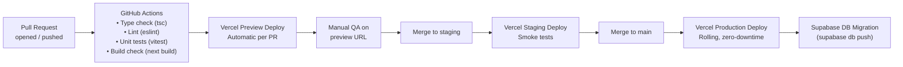

Database migrations run after successful Vercel deploy via a GitHub Actions step using the Supabase CLI. Migrations are always backwards-compatible (additive) so the previous app version can run against the new schema during the rolling deploy window.

### 10.3 Multi-Region Topology

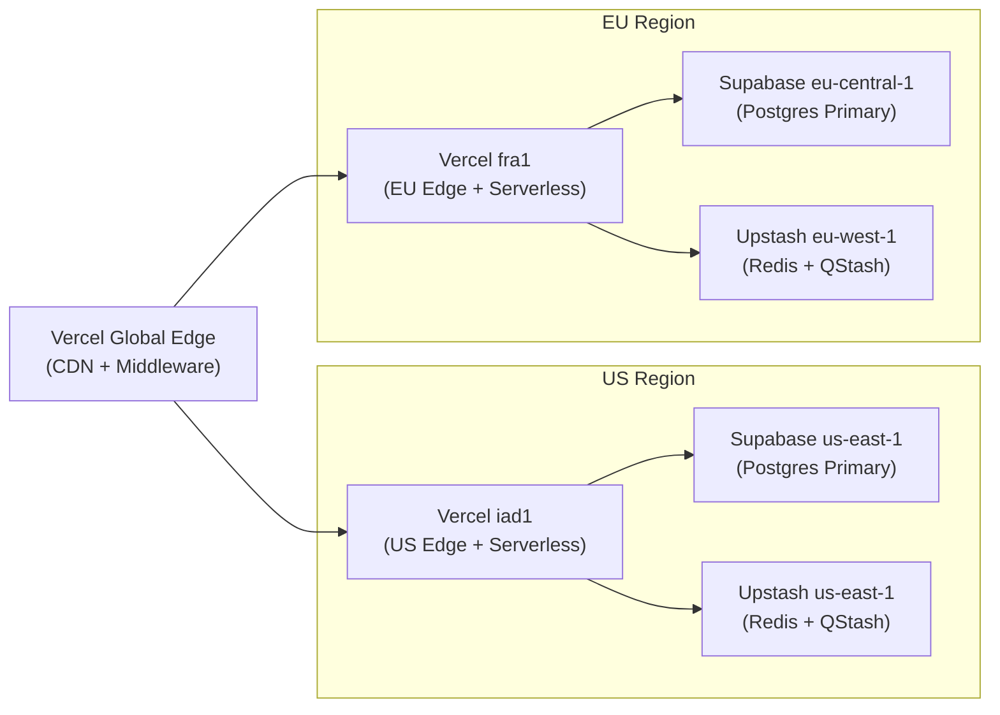

User region is determined at signup using `x-vercel-ip-country` header. EU users (`country IN ['DE','FR','NL','PL','GB',...]`) are routed to the EU Supabase project. US/APAC users route to the US project. The routing decision is stored in `users.data_region` and respected on all subsequent requests.

### 10.4 Infrastructure as Code

Environment configuration managed via:

- **Vercel**: Project settings + CLI (`vercel env pull`) for local development.
- **Supabase**: `supabase/migrations/` directory under version control; applied via `supabase db push` in CI.
- **Upstash**: Resources created manually; connection strings stored in Vercel env vars.
- **GitHub Actions**: Workflow files in `.github/workflows/` for CI and deployment.

### 10.5 Observability

| Signal | Tool | Alerts |
|---|---|---|
| Error tracking | Sentry (Next.js SDK) | PagerDuty on error spike |
| Performance | Vercel Analytics + Speed Insights | P95 > 3s page load |
| API latency | Vercel Functions logs | P99 > 500ms non-AI routes |
| Database | Supabase Dashboard + pg_stat_statements | Slow query > 1s |
| Uptime | Vercel built-in + Better Uptime | Downtime > 1 minute |
| Job queue | Upstash QStash dashboard | Dead-letter queue depth > 0 |

Structured logs from API routes use `pino` with JSON output, forwarded to Vercel Log Drains → a logging aggregator (e.g., Logtail) for search and retention.

### 10.6 Disaster Recovery

| Scenario | Recovery Approach | RTO | RPO |
|---|---|---|---|
| Vercel deployment failure | Instant rollback via Vercel dashboard | < 5 min | 0 |
| Supabase DB corruption | Point-in-time recovery to last known good state | < 1 hour | < 1 hour |
| OpenAI API outage | Graceful degradation: hide AI prompt, show manual invoice form | Automatic | N/A |
| Stripe API outage | Invoice creation still works; payment link creation queued via QStash | < 15 min | N/A |
| Resend outage | Email jobs retried by QStash for up to 24 hours | < 24 hours | N/A |

---

*End of Document*

---

**Document Control**

| Version | Date | Author | Notes |
|---|---|---|---|
| 1.0 | 2026-06-22 | Architecture Team | Initial draft |
